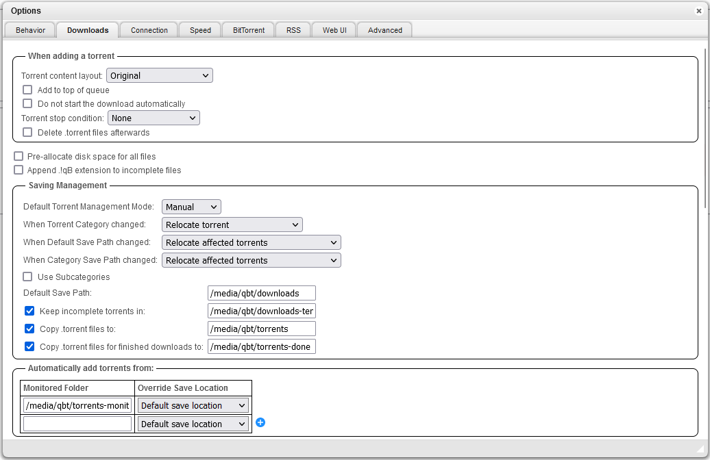
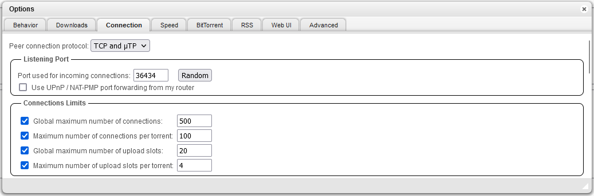
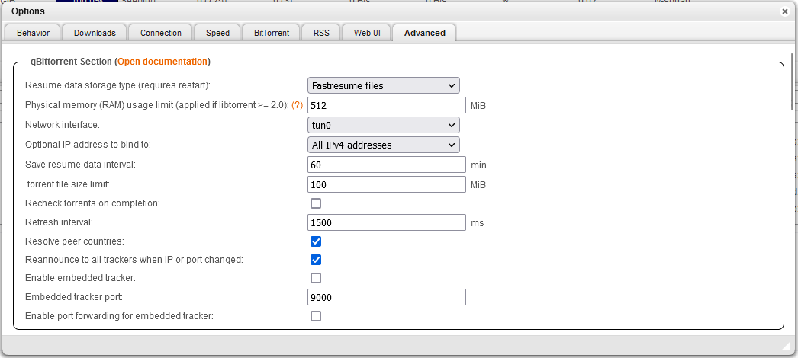

# Self-hosted media center on K8s

## Overview

- **FlareSolverr**: proxy server to bypass Cloudflare protection.
- **qflood**: qBittorrent client with Flood UI.
- **FlareSolverr**: Indexer manager/proxy built on the popular arr net base stack to integrate with your various PVR apps.
- **Prowlarr** Indexer manager/proxy built on the popular arr net base stack to integrate with your various PVR apps.
- **Sonarr**: tv series collection manager for Usenet and BitTorrent users.
- **Radarr**: movie collection manager for Usenet and BitTorrent users.
- **Jellyfin**: Free Software Media System that puts you in control of managing and streaming your media.
- **Jellyseerr**: fork of Overseerr with support for Jellyfin and Emby. It can be used to manage requests for your media library.
- **Jellystat**: A free and open source Statistics App for Jellyfin.

## Prerequisites 

- Kubernetes cluster running on `amd64` (because of TrueCharts dependency) accessible with `kubectl` CLI
  - **Note**: Tested on K3s cluster with default `traefik` ONI.
- Install [Helm](https://helm.sh/docs/intro/install/)

## Helm repo

Get the [TrueCharts](https://truecharts.org/) Helm repository:

```sh
helm repo add truecharts https://charts.truecharts.org
helm repo update truecharts
```

## Setup environment variables

```sh
export MEDIA_NAMESPACE="media-center"
export STORAGE_CLASS="nfs-hdd" # changeme
export MEDIA_VOLUME_SIZE="4Ti" # changeme
export LB_IP="192.168.1.81" # changeme
```

## Create base resources

Create namespace:

```sh
kubectl create ns ${MEDIA_NAMESPACE}
```

Create PVC:

```sh
cat <<EOF | kubectl apply -f -
apiVersion: v1
kind: PersistentVolumeClaim
metadata:
  name: media-pvc
  namespace: ${MEDIA_NAMESPACE}
spec:
  storageClassName: ${STORAGE_CLASS}
  resources:
    requests:
      storage: ${MEDIA_VOLUME_SIZE}
  volumeMode: Filesystem
  accessModes:
    - ReadWriteMany
EOF
```

## BitTorrent client

Install the chart:

```sh
cat <<EOF > qflood.values.yaml
ingress:
  main:
    enabled: true
    hosts:
    - host: qflood.${LB_IP}.nip.io
      paths:
      - path: /
    integrations:
      traefik:
        enabled: false
operator:
  verify:
    enabled: false
persistence:
  media:
    enabled: true
    existingClaim: media-pvc
    mountPath: "/media"
EOF
helm install qflood truecharts/qflood --values qflood.values.yaml --namespace ${MEDIA_NAMESPACE}
```

After install you should be able to reach your Flood UI on your local network at `qflood.${LB_IP}.nip.io`.

## Flaresolverr

Install the chart:

```sh
helm install flaresolverr truecharts/flaresolverr
```

## Prowlarr

Install the chart:

```sh
cat <<EOF > prowlarr.values.yaml
ingress:
  main:
    enabled: true
    hosts:
    - host: prowlarr.${LB_IP}.nip.io
      paths:
      - path: /
    integrations:
      traefik:
        enabled: false
operator:
  verify:
    enabled: false
EOF
helm install prowlarr truecharts/prowlarr --values prowlarr.values.yaml --namespace ${MEDIA_NAMESPACE}
```

After install you should be able to reach your Prowlarr instance on your local network at `prowlarr.${LB_IP}.nip.io`.

## Sonarr

Install the chart:

```sh
cat <<EOF > sonarr.values.yaml
ingress:
  main:
    enabled: true
    hosts:
    - host: sonarr.${LB_IP}.nip.io
      paths:
      - path: /
    integrations:
      traefik:
        enabled: false
operator:
  verify:
    enabled: false
persistence:
  media:
    enabled: true
    existingClaim: media-pvc
    mountPath: "/media"
EOF
helm install sonarr truecharts/sonarr --values sonarr.values.yaml --namespace ${MEDIA_NAMESPACE}
```

After install you should be able to reach your Sonarr instance on your local network at `sonarr.${LB_IP}.nip.io`.

## Radarr

Install the chart:

```sh
cat <<EOF > radarr.values.yaml
ingress:
  main:
    enabled: true
    hosts:
    - host: radarr.${LB_IP}.nip.io
      paths:
      - path: /
    integrations:
      traefik:
        enabled: false
operator:
  verify:
    enabled: false
persistence:
  media:
    enabled: true
    existingClaim: media-pvc
    mountPath: "/media"
EOF
helm install radarr truecharts/radarr --values radarr.values.yaml --namespace ${MEDIA_NAMESPACE}
```

After install you should be able to reach your Radarr instance on your local network at `radarr.${LB_IP}.nip.io`.

You can now configure Radarr:
- In Prowlarr UI, 

## Jellyfin

Install the chart:

```sh
cat <<EOF > jf.values.yaml
ingress:
  main:
    enabled: true
    hosts:
    - host: jf.${LB_IP}.nip.io
      paths:
      - path: /
    integrations:
      traefik:
        enabled: false
operator:
  verify:
    enabled: false
persistence:
  media:
    enabled: true
    existingClaim: media-pvc
    mountPath: "/media"
EOF
helm install jellyfin truecharts/jellyfin --values jf.values.yaml --namespace ${MEDIA_NAMESPACE}
```

After install you should be able to reach your Jellyfin instance on your local network at `jf.${LB_IP}.nip.io`.

## Jellyseerr

Install the chart:

```sh
cat <<EOF > jellyseerr.values.yaml
ingress:
  main:
    enabled: true
    hosts:
    - host: jellyseerr.${LB_IP}.nip.io
      paths:
      - path: /
    integrations:
      traefik:
        enabled: false
operator:
  verify:
    enabled: false
EOF
helm install jellyseerr truecharts/jellyseerr --values jellyseerr.values.yaml --namespace ${MEDIA_NAMESPACE}
```

After install you should be able to reach your Jellyseerr instance on your local network at `jellyseerr.${LB_IP}.nip.io`.

Configure Jellyseerr:
- Open UI at `jellyseerr.${LB_IP}.nip.io`.
- Connect using your Jellyfin server and account.
- Setup connection to Radarr and Sonarr.

## Jellystat

Install the chart:

```sh
cat <<EOF > jellystat.values.yaml
ingress:
  main:
    enabled: true
    hosts:
    - host: jellystat.${LB_IP}.nip.io
      paths:
      - path: /
    integrations:
      traefik:
        enabled: false
operator:
  verify:
    enabled: false
EOF
helm install jellystat truecharts/jellystat --values jellystat.values.yaml --namespace ${MEDIA_NAMESPACE}
```

After install you should be able to reach your Jellystat instance on your local network at `jellystat.${LB_IP}.nip.io`.

## *Optional*: BitTorrent client + VPN setup

### Prerequisites

- Download a wireguard configuration from your VPN provider. 
  - **Note**: the following example is done with ProtonVPN that supports both wireguard and port forwarding for fast seeding.
- Use your existing `media-pvc` PVC (or whatever name you use for it).

### Setup

1. Create a `qbittorrent.values.yaml` file with the following template updated with your wireguard configuration and ingress hostname:
    ```sh
    export QBIT_PASSWORD=<changeme>
    cat <<EOF > qbittorrent.values.yaml
    addons:
      vpn:
        config: |
          # PUT YOUR WIREGUARD CONFIG HERE
        env:
          VPN_SERVICE_PROVIDER: custom
          VPN_TYPE: wireguard
          VPN_PORT_FORWARDING: on
          VPN_PORT_FORWARDING_PROVIDER: protonvpn
        excludedNetworks_IPv4:
        - 192.168.1.0/24 # Replace with your local network CIDR
        type: gluetun
    ingress:
      main:
        enabled: true
        hosts:
        - host: qbit.${LB_IP}.nip.io
          paths:
          - path: /
        integrations:
          traefik:
            enabled: false
    metrics:
      main:
        enabled: false
    operator:
      verify:
        enabled: false
    persistence:
      config:
        enabled: true
        mountPath: /config
      media:
        enabled: true
        existingClaim: media-pvc
        mountPath: /media
    qbitportforward:
      QBT_PASSWORD: ${QBIT_PASSWORD}
      QBT_USERNAME: admin
      enabled: true
    EOF
    ```
2. Install the Helm chart:
    ```sh
    helm install qbittorrent truecharts/qbittorrent --values qbittorrent.values.yaml
    ```
3. Once deployed, update the `qbittorrent` deployment to edit the `mountPath` of the `vpnconfig` in the `qbittorrent-vpn` (Gluetun) container as follow:
    ```sh
    - mountPath: /gluetun/wireguard/wg0.conf
      name: vpnconfig
      subPath: vpn.conf
    ```
4. After checking that `qbittorrent` pod successfully running, navigate to your qbittorrent UI at `qbit.${LB_IP}.nip.io`, login with temporary admin password found in the `qbittorrent` pod logs, and go to **settings** > **Web UI** to update `admin` password and set it to `${QBIT_PASSWORD}`.
5. Now wait for `qbittorrent-qbitportforward` job to complete, then go back to  your qBittorrent UI **settings** to update the settings:
   1. In **Downloads**, your downloads and torrents folders to target your media volume, e.g.:
      
   2. In **Connection** you check that the listening port is correct by comparing it with the one returned by your `qbittorrent-gluetun` service (`curl http://qbittorrent-gluetun:8000/v1/openvpn/portforwarded` from K8s namespace network).
      
   3. In **BitTorrent** make sure `Enable Local Peer Discovery to find more peers` is disabled.
   4. In **Advanced** > **Network interface:** select the `tun0` interface.
      
6. You can validate that qbittorrent is using the VPN interface by using the magnet link from [whatismyip.net](https://www.whatismyip.net/tools/torrent-ip-checker/index.php) and checking the IP that's returned.
